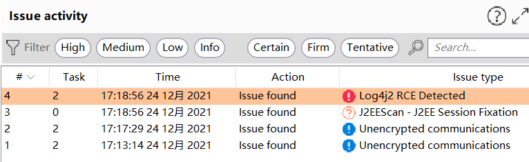
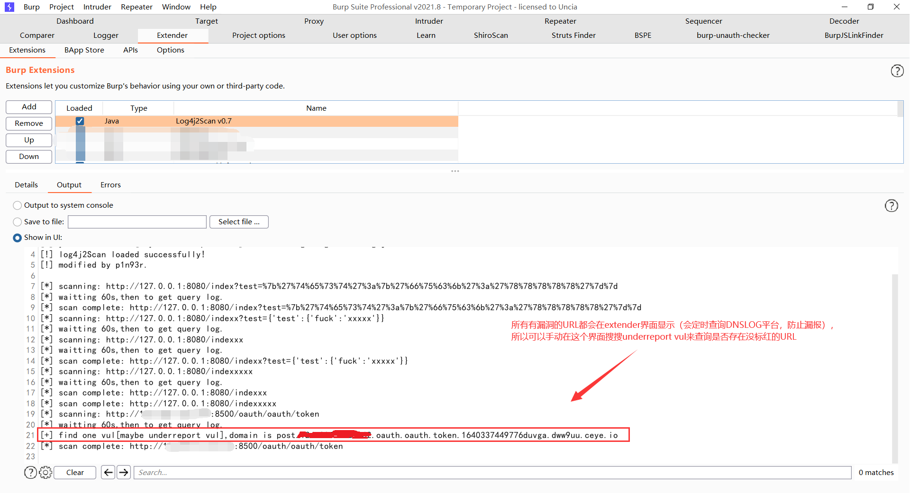
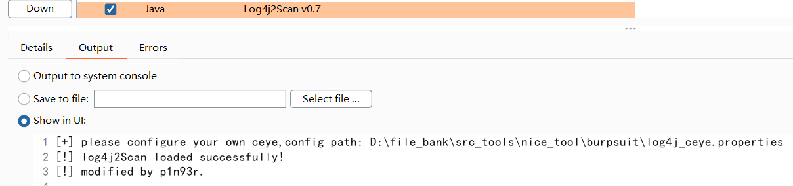
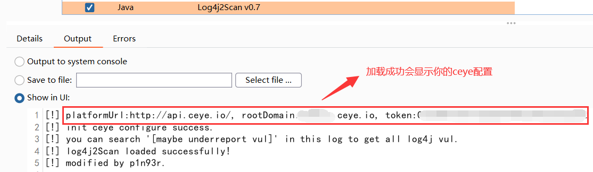

## 介绍
- 此项目的基础框架不是我开发的；
- 原作者git仓库已经被删除了，找不到原作者是谁了，所以就没贴了；
- 我基于原作者的代码（因为他的代码结构好，所以直接使用了），全面修改了扫描逻辑，扫描减少了误报，且减少了大量的请求次数，防止被封IP；

## 使用本扫描器的优势
- 基本不会有漏报，就算因为网络延迟，导致查询 `DNSLOG` 平台失败，也可以在 `burp extender` 界面搜索 `maybe underreport vul` 来查询是否存在漏报的情况；
- 从配置文件中读取 `ceye` 配置，方便配置；
- 发包少，减少被 `ban` 的风险；
- 发包检测的 `payload` 都是基于绕 `waf` 的，减少被 `ban` 的风险；
- 发包检测的 `payload` 有一定的标识信息，例如： `POST.127.0.0.1.pathOne.pathTwo.pathThree.1640337449776DUvga.xx.ceye.io` ，代表存在漏洞的URL为： `127.0.0.1/pathOne/pathTwo/pathThree` ；
- 支持检测 `json` 格式的请求、普通 `form` 表单和 `json` 串混合的请求、 `MULTIPART` 类型的 `form` 表单请求；

## 演示

正常情况下，可以在 `Dashboard` 界面看到扫描结果：

如果因为网络问题，请求 `DNSLOG` 平台失败，导致漏报，没有标红显示在 `Dashboard` 界面，可以在这个界面搜索 `maybe underreport vul` ，查看是否存在漏报的情况：

## 使用说明

首次加载后，会生成一个 `ceye` 配置文件模板，提示如下：

在提示的配置文件中配置你的 `ceye` :

保存好配置后，重新加载插件：

